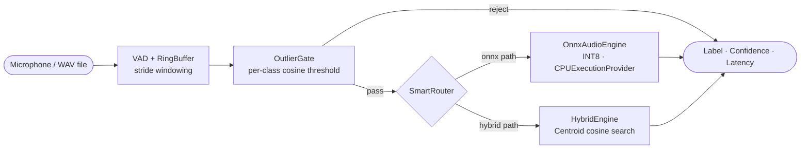

# ShipAssist

> 🇷🇺 [Читать на русском](README.ru.md)


**Real-time Russian maritime voice command recognition — LoRA-fine-tuned Wav2Vec2 on ONNX INT8.**

ShipAssist is an end-to-end production ML pipeline for command-and-control aboard vessels. A 317 M-parameter transformer encoder is efficiently adapted with LoRA, compressed to INT8 ONNX, and served as both a REST API and a real-time microphone listener — fully offline, CPU-only, no cloud dependency.

---

## Key Features

| Feature | Detail |
|---|---|
| **Low latency** | 247 ms avg / 333 ms P95 on x86-64 CPU (INT8, 3 s window) |
| **Fully offline** | Single ONNX INT8 file — no CUDA, no network |
| **Hybrid routing** | `SmartRouter` dispatches between ONNX softmax and embedding-cosine paths |
| **Outlier gate** | `EnsembleOutlierGate`: Mahalanobis (w=0.5) + cosine (w=0.25) + L2 (w=0.25), 95th-percentile threshold; AUROC=0.921 on ESC-50 |
| **Calibrated confidence** | Per-label confidence floors; FPR-on-noise ≤ 1% at operating point |
| **REST + CLI** | FastAPI `/recognize` endpoint and live microphone loop |
| **Reproducible** | Fixed seeds, YAML-driven config, Pydantic fail-fast validation |

---

## Architecture



Full data-flow diagram (training → export → runtime) is in [`docs/architecture.md`](docs/architecture.md).

---

## Performance

Measured on Intel Core i5-6300U (2.4 GHz, 2 cores, CPU-only, no GPU), 3 s / 16 kHz inference window, N=300 runs.

| Backend | Avg latency | P50 | P95 | P99 | RAM (steady) | File size | F1 |
|---|---|---|---|---|---|---|---|
| **ONNX INT8** ✅ | **247 ms** | **248 ms** | **333 ms** | **407 ms** | **379 MB** | **339 MB** | **0.98** |
| ONNX FP32 | 328 ms | ~330 ms | ~443 ms | ~541 ms | ~800 MB | ~600 MB | 0.98 |
| PyTorch FP32 | 474 ms | ~476 ms | ~640 ms | ~781 ms | ~1 200 MB | ~1 200 MB | 0.98 |

ONNX INT8 is **1.9× faster** than PyTorch FP32 (474 ms → 247 ms) with a δF1 = 1.5 pp accuracy delta (0.999 → 0.984), within the acceptable threshold. The ONNX inference stage (Stage 1) accounts for 99.7% of total latency; preprocessing, OOD filtering, and classification add < 1.2 ms combined.

> **Note on startup RSS**: Peak RSS at startup is ~732 MB due to simultaneous ONNX graph loading and NumPy/ONNX Runtime JIT warm-up. RSS stabilises at **379 MB** after ~60 min and remains flat over 24-hour continuous operation.

### Comparison with Alternative Architectures

Evaluated on the same held-out test set (N=300 real recordings, 5 unseen speakers; clean + SNR ≈ 12 dB), Intel Core i5-6300U, CPU-only.

| Method | F1 (clean) | F1 (SNR 12 dB) | Latency avg | RAM | 95% CI (Clopper–Pearson) |
|---|---|---|---|---|---|
| MFCC + SVM | 0.56 | 0.47 | ~3 ms | ~50 MB | [0.477; 0.658] |
| Whisper-tiny (zero-shot) | 0.63 | 0.42 | ~420 ms | ~600 MB | [0.526; 0.704] |
| ECAPA-TDNN + MLP | 0.91 | 0.82 | ~90 ms | ~220 MB | [0.846; 0.955] |
| **LoRA-Wav2Vec2 + ONNX INT8** ✅ | **0.98** | **0.94** | **247 ms** | **339 MB** | **[0.942; 0.998]** |

All pairwise comparisons against baselines are statistically significant (p ≤ 0.01, Wilcoxon signed-rank, Holm correction, rank-biserial r ≥ 0.71).

```bash
python scripts/main_demo_defense.py --mode bench --samples 50
# → artifacts/benchmarks/defense_metrics.json
```

---

## Quick Start

```bash
# 1. Create and activate virtual environment
python -m venv .venv
.venv\Scripts\Activate.ps1        # Windows PowerShell
# source .venv/bin/activate        # Linux / macOS

# 2. Install dependencies
pip install -r requirements.txt

# For training, evaluation, or data preparation:
# pip install -r requirements-dev.txt

# 3. Configure environment (optional — all values have sensible defaults)
cp .env.example .env              # then edit .env as needed

# 4. Create required directories
mkdir -p artifacts/models/onnx_model artifacts/models/best_model artifacts/data artifacts/benchmarks logs

# 5. Place ONNX model bundle in artifacts/models/onnx_model/
#    (must contain onnx_config.json + model_int8.onnx)

# 6. Validate config
python -c "from core.config import load_config, validate_runtime_paths; s = load_config(); validate_runtime_paths(s); print('Config OK')"

# 7. Run the defense benchmark
python scripts/main_demo_defense.py --mode bench

# 8. Start the REST API
python src/api.py
# → http://localhost:8000/docs

# 9. Start real-time microphone recognition
python src/inference.py --mode onnx
```

For full setup, training from scratch, and troubleshooting see [RUNBOOK.md](RUNBOOK.md).

---

## Project Structure

```
ShipAssist/
├── core/                          # ML/Audio engine (production code only)
│   ├── config.py                  # Pydantic Settings — 3-YAML deep-merge + env overrides
│   ├── engine.py                  # AudioEngine ABC, OnnxAudioEngine, TorchAudioEngine
│   ├── onnx_engine.py             # ONNX Runtime session wrapper (INT8/FP32/FP16)
│   ├── router.py                  # SmartRouter — ONNX/Hybrid dispatch + OutlierGate
│   ├── recognizer.py              # RingBuffer + RealTimeRecognizer (thread-safe)
│   ├── embedders.py               # Audio embedding models (WTV, MFCC, GigaAM…)
│   ├── preproc.py                 # Preprocessing pipeline (normalise, trim, augment)
│   ├── monitor.py                 # Background RAM/CPU monitor (threshold from config)
│   ├── hybrid/                    # HybridEngine: centroid search, embedding distance
│   ├── logger.py                  # Rotating JSON event logger (_WinSafeRotatingFileHandler)
│   └── exceptions.py              # Typed exception hierarchy
│
├── src/                           # Application layer
│   ├── api.py                     # FastAPI (POST /recognize, GET /health, /commands, /logs)
│   ├── trainer_utils.py           # EMA, FocalLoss, mixup helpers
│   ├── inference.py               # CLI real-time recognition loop
│   └── train.py                   # Training entry point
│
├── scripts/                       # Developer utilities (main_* = runnable entry points)
│   ├── main_demo_defense.py       # Thesis defense CLI: bench / realtime / api modes
│   ├── main_router_demo.py        # SmartRouter live demo
│   ├── main_smoke_test_api.py     # API smoke test
│   ├── data/                      # Dataset assembly (Mozilla CV download, metadata)
│   ├── preprocessing/             # Audio conversion, VAD segmentation, augmentation
│   ├── generation/                # TTS synthesis for data augmentation
│   ├── train/                     # LoRA fine-tuning, ONNX export, calibration, benchmarks
│   ├── hybrid/                    # Hybrid engine: centroid building, OOD detector training
│   ├── evaluation/                # SNR profiling, memory measurement, F1 vs SNR plots
│   └── utils/                     # System checks, live inference runners, t-SNE viz
│
├── experiments/                   # Archived research code — never imported by core/ or src/
│   ├── best_params.py             # Optuna best-params snapshots
│   └── search/                    # ASR/classifier search strategies (Whisper, Vosk, DTW…)
│
├── configs/                       # YAML configurations (all paths relative to PROJECT_ROOT)
│   ├── base.yaml                  # Artifact paths, logging, monitor thresholds
│   ├── model.yaml                 # Model type, per-label thresholds, ONNX flags
│   ├── inference.yaml             # Audio: sr=16000, window=1.0 s, stride=0.5 s
│   ├── routing.yaml               # SmartRouter: confidence floors, cosine alignment
│   └── hybrid/                    # Hybrid engine: centroid model + thresholds
│
├── tests/                         # pytest test suite
│
├── docs/
│   ├── architecture.md            # Full system architecture, design decisions
│   └── audit_lora_pipeline.md     # LoRA pipeline audit: bugs, gaps, action plan
│
├── artifacts/                     # NOT tracked in git
│   ├── models/                    # ONNX model bundle, PyTorch checkpoints
│   ├── benchmarks/                # Metrics JSON/CSV, comparison PDFs
│   ├── plots/                     # Confusion matrices, ROC curves, t-SNE, latency charts
│   └── data/                      # Dataset metadata CSVs
│
├── logs/                          # Runtime logs — rotating JSON (git-ignored)
├── requirements.txt               # Production dependencies
├── requirements-dev.txt           # Training / research / evaluation extras
├── pyproject.toml                 # Build metadata, pytest & ruff config, entry points
├── .env.example                   # Template for SHIP_* environment variable overrides
├── RUNBOOK.md                     # Step-by-step operational guide
└── CLAUDE.md                      # Development guidelines for AI-assisted coding
```

---

## Recognised Commands

| Command (Russian) | Label | Confidence threshold |
|---|---|---|
| «машина» | `mashina` | 0.92 |
| «приготовить машину» | `prigotovit_mashinu` | 0.95 |
| «самый малый вперед» | `samyy_malyy_vpered` | 0.85 |

Thresholds are per-label and configurable in `configs/model.yaml` without retraining. A global fallback of `0.80` applies to any unlisted label.

---

## Technology Stack

| Component | Technology | Rationale |
|---|---|---|
| Base model | `jonatasgrosman/wav2vec2-large-xlsr-53-russian` | State-of-the-art multilingual encoder, Russian pre-trained |
| Fine-tuning | LoRA (r=32, α=64, `[q_proj, v_proj, out_proj]`) | ~14.7 M trainable params (4.6% of 317 M); efficient small-dataset adaptation |
| Production inference | ONNX Runtime + INT8 dynamic quantisation | 2–3× lower CPU latency; single-file deployment; no CUDA |
| Confidence calibration | Temperature scaling (val-fitted) | Calibrated probabilities; reduces FPR at threshold |
| Routing | `SmartRouter` + `OutlierGate` | Hybrid cosine/softmax dispatch; OOD rejection before inference |
| Config management | Pydantic `BaseSettings` + 3-layer YAML merge | Zero hardcoded values; env-variable overrides; fail-fast validation |
| API layer | FastAPI + lifespan context manager | Async, auto-documented, production-ready |
| Real-time audio | `sounddevice` + thread-safe `RingBuffer` | Graceful mic reconnect; configurable window/stride |

---

## API Reference

| Method | Endpoint | Description |
|---|---|---|
| `GET` | `/health` | Engine status, uptime, provider |
| `GET` | `/commands` | List of loaded label names |
| `POST` | `/recognize` | Upload `.wav`/`.mp3`/`.m4a` → `{label, confidence, latency_ms}` |
| `GET` | `/logs?limit=N` | Last N recognition events (default 10, max 100) |

Interactive docs at `http://localhost:8000/docs`.

---

## Reproducibility

All experiments are reproducible given:
- Dataset CSV at `artifacts/data/dataset.csv`
- Configs in `configs/` (tracked in git)
- Fixed random seed (`seed=42`) throughout training and benchmarks
- `worker_init_fn` seeding in all `DataLoader` instances

Hyperparameters, Optuna results, and benchmark outputs are committed as JSON under `artifacts/benchmarks/`. See `docs/architecture.md §Reproducibility` for the full checksum list.

---

## Documentation

| Document | Purpose |
|---|---|
| [`docs/architecture.md`](docs/architecture.md) | Full data-flow, ONNX vs Torch comparison, config-driven design, module dependency graph |
| [`docs/audit_lora_pipeline.md`](docs/audit_lora_pipeline.md) | LoRA pipeline audit: critical bugs, evaluation gaps, prioritised action plan |
| [`RUNBOOK.md`](RUNBOOK.md) | Step-by-step operational guide: environment → config → benchmark → API → training |
| [`CLAUDE.md`](CLAUDE.md) | Development guidelines: canonical structure, code quality, commit standards |

---

## First-time git setup

After cloning, remove any committed log files from git tracking (they are already git-ignored going forward):

```bash
git rm --cached logs/app.log logs/app.log.1 logs/memory_24h.csv logs/memory_smoke.csv
git commit -m "chore: untrack committed log files"
```
