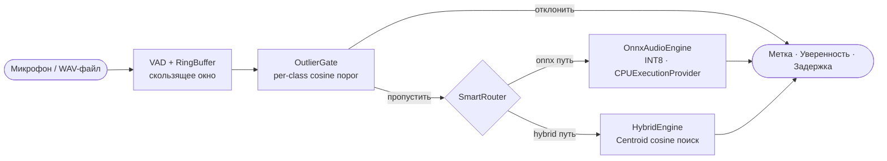

# ShipAssist

**Распознавание голосовых команд на русском языке в реальном времени — Wav2Vec2 с LoRA-дообучением, квантизация INT8 через ONNX Runtime.**

ShipAssist — это сквозной ML-пайплайн для управления командами на судне. Трансформерный энкодер на 317 M параметров эффективно адаптирован с помощью LoRA, сжат до INT8 ONNX и обёрнут в REST API и CLI-слушатель микрофона — полностью офлайн, только CPU, без облачных зависимостей.

---

## Ключевые возможности

| Функция | Детали |
|---|---|
| **Малая задержка** | 247 мс средняя / 333 мс P95 на x86-64 CPU (INT8, окно 3 с) |
| **Полностью офлайн** | Один файл ONNX INT8 — без CUDA, без сети |
| **Гибридная маршрутизация** | `SmartRouter` диспетчеризует между ONNX softmax и cosine-путём по эмбеддингам |
| **Отсечение выбросов** | `EnsembleOutlierGate`: Махаланобис (w=0.5) + косинус (w=0.25) + L2 (w=0.25), порог 95-й перцентиль; AUROC=0.921 на ESC-50 |
| **Калиброванное доверие** | Per-label пороги уверенности; FPR-on-noise ≤ 1% в рабочей точке |
| **REST API + CLI** | FastAPI эндпоинт `/recognize` и цикл прослушивания микрофона |
| **Воспроизводимость** | Фиксированные сиды, YAML-конфигурация, Pydantic fail-fast валидация |

---

## Архитектура



Полная диаграмма потока данных (обучение → экспорт → инференс) — в [`docs/architecture.md`](docs/architecture.md).

---

## Производительность

Измерено на Intel Core i5-6300U (2.4 ГГц, 2 ядра, только CPU), окно инференса 3 с / 16 кГц, N=300 прогонов.

| Бэкенд | Средняя задержка | P50 | P95 | P99 | RSS (устойчивое) | Размер файла | F1 |
|---|---|---|---|---|---|---|---|
| **ONNX INT8** ✅ | **247 мс** | **248 мс** | **333 мс** | **407 мс** | **379 МБ** | **339 МБ** | **0.98** |
| ONNX FP32 | 328 мс | ~330 мс | ~443 мс | ~541 мс | ~800 МБ | ~600 МБ | 0.98 |
| PyTorch FP32 | 474 мс | ~476 мс | ~640 мс | ~781 мс | ~1 200 МБ | ~1 200 МБ | 0.98 |

ONNX INT8 работает **в 1.9 раза быстрее** PyTorch FP32 (474 мс → 247 мс) при потере F1 δ = 1.5 пп (0.999 → 0.984), что укладывается в допустимый порог. Этап ONNX-инференса (Stage 1) занимает 99.7% суммарной задержки; предобработка, OOD-фильтрация и классификация вместе добавляют менее 1.2 мс.

> **Примечание о RSS при старте**: пиковое RSS при запуске — ~732 МБ (одновременная загрузка ONNX-графа и прогрев JIT). Через ~60 мин RSS стабилизируется на уровне **379 МБ** и остаётся неизменным при 24-часовой непрерывной работе.

### Сравнение с альтернативными архитектурами

Оценка на едином тестовом наборе (N=300 реальных записей, 5 дикторов, не участвовавших в обучении; чистые данные + ОСШ ≈ 12 дБ), Intel Core i5-6300U, только CPU.

| Метод | F1 (чистые) | F1 (ОСШ 12 дБ) | Задержка (ср.) | RAM | 95% ДИ (Клоппер–Пирсон) |
|---|---|---|---|---|---|
| MFCC + SVM | 0.56 | 0.47 | ~3 мс | ~50 МБ | [0.477; 0.658] |
| Whisper-tiny (zero-shot) | 0.63 | 0.42 | ~420 мс | ~600 МБ | [0.526; 0.704] |
| ECAPA-TDNN + MLP | 0.91 | 0.82 | ~90 мс | ~220 МБ | [0.846; 0.955] |
| **LoRA-Wav2Vec2 + ONNX INT8** ✅ | **0.98** | **0.94** | **247 мс** | **339 МБ** | **[0.942; 0.998]** |

Все попарные сравнения с базовыми линиями статистически значимы (p ≤ 0.01, критерий Уилкоксона, поправка Холма, ранговый биссериальный r ≥ 0.71).

```bash
python scripts/main_demo_defense.py --mode bench --samples 50
# → artifacts/benchmarks/defense_metrics.json
```

---

## Быстрый старт

```bash
# 1. Создать и активировать виртуальное окружение
python -m venv .venv
.venv\Scripts\Activate.ps1         # Windows PowerShell
# source .venv/bin/activate         # Linux / macOS

# 2. Установить зависимости
pip install -r requirements.txt

# 3. Создать необходимые директории
mkdir -p artifacts/models/onnx_model artifacts/models/best_model artifacts/data artifacts/benchmarks logs

# 4. Поместить ONNX-модель в artifacts/models/onnx_model/
#    (должна содержать onnx_config.json + model_int8.onnx)

# 5. Проверить конфигурацию
python -c "from core.config import Settings; s = Settings(); print('Config OK')"

# 6. Запустить benchmark
python scripts/main_demo_defense.py --mode bench

# 7. Запустить REST API
python src/api.py
# → http://localhost:8000/docs

# 8. Запустить распознавание с микрофона в реальном времени
python src/inference.py --mode onnx
```

Полное руководство по настройке, обучению с нуля и диагностике — в [RUNBOOK.md](RUNBOOK.md).

---

## Структура проекта

```
ShipAssist/
├── core/                          # ML/Audio движок
│   ├── config.py                  # Pydantic Settings — трёхуровневый YAML merge
│   ├── engine.py                  # AudioEngine ABC, OnnxAudioEngine, TorchAudioEngine
│   ├── onnx_engine.py             # Обёртка ONNX Runtime (INT8/FP32)
│   ├── router.py                  # SmartRouter — диспетчер ONNX/Hybrid + OutlierGate
│   ├── recognizer.py              # RingBuffer + RealTimeRecognizer (потокобезопасный)
│   ├── hybrid/                    # HybridEngine: centroid-поиск, дистанции эмбеддингов
│   ├── logger.py                  # Ротируемый JSON-логгер событий
│   └── exceptions.py              # Типизированная иерархия исключений
│
├── src/                           # Слой приложения
│   ├── api.py                     # FastAPI (POST /recognize, GET /health, /commands, /logs)
│   ├── inference.py               # CLI-цикл распознавания в реальном времени
│   └── train.py                   # Точка входа для обучения
│
├── scripts/                       # Утилиты разработчика (main_* = запускаемые скрипты)
│   ├── main_demo_defense.py       # Демо для защиты: режимы bench / realtime / api
│   ├── main_router_demo.py        # Живое демо SmartRouter
│   ├── main_smoke_test_api.py     # Smoke-тест API
│   ├── data/                      # Сборка датасета (Mozilla CV, метаданные)
│   ├── preprocessing/             # Конвертация аудио, VAD-сегментация, аугментация
│   ├── generation/                # TTS-синтез для аугментации данных
│   ├── train/                     # LoRA fine-tuning, ONNX-экспорт, калибровка, бенчмарки
│   ├── hybrid/                    # Hybrid: построение центроидов, обучение OOD-детектора
│   ├── evaluation/                # SNR-профилирование, замер памяти, построение графиков
│   └── utils/                     # Проверка системы, запуск инференса, t-SNE визуализация
│
├── configs/                       # YAML-конфигурации (пути — относительно PROJECT_ROOT)
│   ├── base.yaml                  # Пути артефактов, ротация логов
│   ├── model.yaml                 # Тип модели, per-label пороги, флаги ONNX
│   ├── inference.yaml             # Аудио: sr=16000, window=1.0 с, stride=0.5 с
│   ├── routing.yaml               # SmartRouter: пороги уверенности, cosine-выравнивание
│   └── hybrid/                    # Hybrid: centroid-модель + пороги
│
├── tests/                         # Тест-сьют (pytest)
│
├── docs/
│   ├── architecture.md            # Полная архитектура, архитектурные решения
│   └── audit_lora_pipeline.md     # Аудит LoRA-пайплайна: баги, пробелы, план действий
│
├── artifacts/                     # НЕ отслеживается git (см. .gitignore)
│   ├── models/                    # ONNX-модель, PyTorch-чекпоинты
│   ├── benchmarks/                # Метрики JSON/CSV, PDF-сравнения
│   ├── plots/                     # Матрицы ошибок, ROC-кривые, t-SNE, графики задержки
│   └── data/                      # CSV-метаданные датасетов
│
├── logs/                          # Runtime-логи (ротируемый JSON)
├── requirements.txt
├── RUNBOOK.md                     # Операционное руководство шаг за шагом
└── CLAUDE.md                      # Руководство по разработке для AI-ассистента
```

---

## Распознаваемые команды

| Команда | Метка | Порог уверенности |
|---|---|---|
| «машина» | `mashina` | 0.92 |
| «приготовить машину» | `prigotovit_mashinu` | 0.95 |
| «самый малый вперед» | `samyy_malyy_vpered` | 0.85 |

Пороги настраиваются per-label в `configs/model.yaml` без переобучения. Глобальный fallback — `0.80` для меток без явного порога.

---

## Технологический стек

| Компонент | Технология | Обоснование |
|---|---|---|
| Базовая модель | `jonatasgrosman/wav2vec2-large-xlsr-53-russian` | SOTA многоязычный энкодер, предобучен на русском |
| Дообучение | LoRA (r=32, α=64, `[q_proj, v_proj, out_proj]`) | ~14.7 млн обучаемых параметров (4.6% от 317 млн); эффективная адаптация на малом датасете |
| Продакшн-инференс | ONNX Runtime + INT8 динамическая квантизация | В 2–3 раза ниже задержка на CPU; однофайловый деплой; без CUDA |
| Калибровка | Temperature scaling (на val-выборке) | Калиброванные вероятности; снижение FPR при пороге |
| Маршрутизация | `SmartRouter` + `OutlierGate` | Гибридный диспетчер cosine/softmax; отклонение OOD до инференса |
| Конфигурация | Pydantic `BaseSettings` + 3-уровневый YAML merge | Нет захардкоженных значений; env-переменные; fail-fast валидация |
| API | FastAPI + lifespan context manager | Async, авто-документация, production-ready |
| Реальное время | `sounddevice` + потокобезопасный `RingBuffer` | Переподключение микрофона; настраиваемое окно/шаг |

---

## Справочник API

| Метод | Эндпоинт | Описание |
|---|---|---|
| `GET` | `/health` | Статус движка, uptime, провайдер |
| `GET` | `/commands` | Список загруженных меток |
| `POST` | `/recognize` | Загрузить `.wav`/`.mp3`/`.m4a` → `{label, confidence, latency_ms}` |
| `GET` | `/logs?limit=N` | Последние N событий распознавания (по умолчанию 10, макс 100) |

Интерактивная документация: `http://localhost:8000/docs`.

---

## Воспроизводимость

Все эксперименты воспроизводимы при наличии:
- CSV-датасета в `artifacts/data/dataset.csv`
- Конфигов в `configs/` (отслеживаются в git)
- Фиксированного сида (`seed=42`) в обучении и бенчмарках
- `worker_init_fn`-сидирования во всех `DataLoader`

Гиперпараметры, результаты Optuna и бенчмарки зафиксированы как JSON в `artifacts/benchmarks/`. Полный список контрольных сумм — в `docs/architecture.md §Reproducibility`.

---

## Документация

| Документ | Назначение |
|---|---|
| [`docs/architecture.md`](docs/architecture.md) | Полный поток данных, сравнение ONNX/Torch, config-driven дизайн, граф зависимостей модулей |
| [`docs/audit_lora_pipeline.md`](docs/audit_lora_pipeline.md) | Аудит LoRA-пайплайна: критические баги, пробелы в оценке, приоритетный план |
| [`RUNBOOK.md`](RUNBOOK.md) | Пошаговое руководство: окружение → конфиг → benchmark → API → обучение |
| [`CLAUDE.md`](CLAUDE.md) | Руководство по разработке: каноническая структура, стиль кода, стандарты коммитов |
