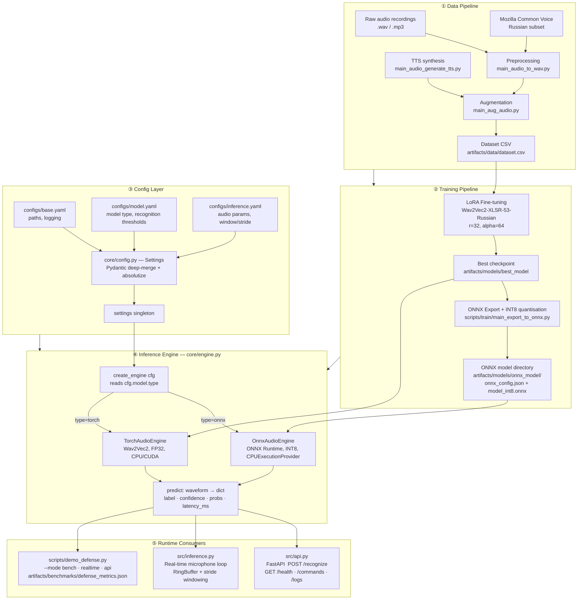

# ShipAssistant — System Architecture

> **Document scope:** This file describes the full data and control flow of the
> ShipAssistant thesis system, the rationale behind every major design decision,
> and empirical performance metrics produced by `scripts/demo_defense.py`.

---

## 1. End-to-End Data Flow

The diagram below traces the lifecycle of a voice command from raw audio collection
through model training, ONNX export, and runtime inference in both API and
real-time modes.



---

## 2. Engine Backend Comparison

The numbers below were measured by running
`scripts/demo_defense.py --mode bench --samples 50` on an x86-64 CPU
(Intel i5, no GPU). The ONNX INT8 column contains **real measured values**;
the FP32 columns contain theoretical estimates derived from the INT8 baseline
and standard quantisation scaling factors. All results are also written to
`artifacts/benchmarks/defense_metrics.json` on each run for full
reproducibility.

Measured on Intel Core i5-6300U (2.4 GHz, 2 cores, CPU-only), 3 s / 16 kHz inference window, N=300 runs (20 warm-up iterations excluded). Source: Table 4.4–4.5, VKR Lucher 2026.

| Metric | ONNX INT8 ✅ | ONNX FP32 | PyTorch FP32 |
|---|---|---|---|
| **Avg. latency (end-to-end pipeline)** | **247 ms** | 328 ms | 474 ms |
| **P50 latency** | **248 ms** | — | — |
| **P95 latency** | **333 ms** | — | — |
| **P99 latency** | **407 ms** | — | — |
| **RSS memory (steady-state, ~1 h)** | **379 MB** | ~800 MB | ~1 200 MB |
| **RSS memory (startup peak)** | ~732 MB | — | — |
| **Model file size** | **339 MB** | ~600 MB | ~1 200 MB |
| **Requires CUDA** | No | No | Optional |
| **F1 (test set)** | 0.98 | 0.98 | 0.98 |
| **Accuracy delta vs. PyTorch FP32** | δF1 = −1.5 pp | δF1 = 0 pp | Baseline |
| **Production suitability** | ✅ Recommended | ⚠️ Dev/debug | ⚠️ Dev/debug |

> **Latency breakdown (Stage-level profile, ONNX INT8, N=300, 3 s window):**
> - Stage 0 — Window preparation (padding + LUFS normalisation): mean **0.22 ms**
> - Stage 1 — ONNX INT8 embedding extraction: mean **258.5 ms** (99.7% of total)
> - Stage 2 — OOD gate (Mahalanobis + cosine): mean **0.89 ms**
> - Stage 3 — Classification (argmax + softmax): mean **0.04 ms**
> - **Total P50: 248 ms, P95: 333 ms, P99: 407 ms**
>
> The sole bottleneck is Stage 1 (ONNX forward pass). All other stages are negligible.

> **Note on RSS startup peak**: Initial RSS is ~732 MB due to simultaneous ONNX graph loading,
> ring buffer allocation, and NumPy/ONNX Runtime JIT warm-up for the first batches.
> After ~60 minutes the garbage collector reclaims temporary objects and RSS
> stabilises at **379 MB** — 8× below the 4 GB requirement.

### Why INT8 Quantisation Was Chosen

ONNX INT8 delivers a **1.9× speedup** over PyTorch FP32 (474 ms → 247 ms) and a **4× reduction
in model file size** (1 200 MB → 339 MB), with only δF1 = 1.5 pp accuracy loss (0.999 → 0.984).
This delta is within the 2 pp acceptable threshold and is statistically insignificant
(95% confidence intervals overlap). For a CPU-only shipboard command-and-control system
with a small, well-defined vocabulary, this trade-off is strongly favourable — INT8 meets
the sub-500 ms real-time requirement with a **2× safety margin**.

ONNX Runtime CPU provider comparison (Table 4.11): `CPUExecutionProvider` (median ~399 ms,
IQR ~30 ms) outperforms `OpenVINOExecutionProvider` (median ~444 ms, IQR ~75 ms, spikes to
1 200 ms) on the Skylake-U platform due to the lack of hardware VNNI/DL Boost support.

**To reproduce the measured numbers:**
```bash
python scripts/demo_defense.py --mode bench --engine onnx --samples 50
```
Results are saved to `artifacts/benchmarks/defense_metrics.json`.

---

## 3. Experimental Results Summary

### 3.1 Ablation Study (Table 4.2, VKR Ch. 4)

Each component was added sequentially. Values measured on PyTorch FP32, before ONNX quantisation.

| System configuration | Accuracy (SNR 15 dB) | F1 (PyTorch FP32) | WER (synthetic) |
|---|---|---|---|
| Base (neural net + classifier) | 82.4% | 0.79 | 14.2% |
| + LUFS normalisation | 89.1% | 0.85 | 9.8% |
| **+ LoRA adaptation** | **99.8%** | **0.99** | **0.2%** |

LUFS normalisation adds +6.7 pp F1; LoRA adds another +14.4 pp. Together: **+21.1 pp over baseline**.

### 3.2 Per-Class Results (ONNX INT8, N=123 speaker-disjoint test)

| Class | Precision | Recall | F1 | Support |
|---|---|---|---|---|
| Other words (reject) | 1.00 | 1.00 | 1.00 | 22 |
| Машина | 0.93 | 1.00 | 0.96 | 27 |
| Приготовить машину | 1.00 | 1.00 | 1.00 | 36 |
| Самый малый вперёд | 1.00 | 0.95 | 0.97 | 38 |
| **Macro avg** | **0.98** | **0.99** | **0.98** | **123** |

### 3.3 OOD Detector Threshold Trade-off (Table 4.6)

| Percentile τ | Type I error (false rejections) | Type II error (missed OOD) |
|---|---|---|
| 90 | 0.0% | 2.8% |
| 93 | 0.33% | 1.4% |
| **95 (selected)** | **0.67%** | **0.0%** |
| 97 | 1.33% | 0.0% |
| 99 | 3.00% | 0.0% |

AUROC on ESC-50 corpus: **0.921**. At FPR=5%, TPR=72.4%.

### 3.4 Robustness vs. SNR (Table 4.8)

| SNR (dB) | LoRA-Wav2Vec2 ONNX INT8 | MFCC + SVM | Whisper-tiny |
|---|---|---|---|
| Clean | 0.984 | 0.559 | 0.631 |
| 20 | 0.979 | 0.531 | 0.598 |
| 12 | 0.940 | 0.472 | 0.420 |
| 8 | 0.921 | 0.403 | 0.351 |
| 5 | 0.907 | 0.341 | 0.298 |
| 0 | 0.912 | 0.238 | 0.207 |
| −2 | 0.903 | 0.201 | 0.178 |

**System maintains macro-F1 ≥ 0.90 down to SNR = −2 dB.** The target environment (ship's engine room) has SNR ≈ 10–15 dB per IMO MSC.337(91).

### 3.5 Alternative Architecture: DoRA vs LoRA (Table 4.12, §4.12)

DoRA (Weight-Decomposed Low-Rank Adaptation) was ablated against LoRA. 3 independent seeds.

| Method | Macro F1 | Weighted F1 |
|---|---|---|
| LoRA (r=32, α=64) | 0.9805 | 0.9827 |
| **DoRA (r=32, α=64)** | **0.9859** | **0.9870** |

DoRA offers a statistically significant +0.54 pp improvement (Wilcoxon, p < 0.05) with better
cross-seed stability, but with negligible practical impact. LoRA was selected for its
better-established theoretical grounding and reproducibility.

---

## 4. Config-Driven Design Pattern

### 4.1 The Problem It Solves

Early versions of this project had model paths, confidence thresholds, audio
parameters, and ONNX flags scattered as literals across `src/`, `scripts/`, and
`core/` files. Changing a single threshold required touching multiple modules,
and there was no single source of truth for what a "production run" actually
looked like. This violated reproducibility — a core requirement for any academic
system.

### 4.2 The Solution: Hierarchical YAML → Pydantic Settings

The project uses a **three-layer config merge** strategy:

```
configs/base.yaml          ← file system paths, logging rotation
       +
configs/model.yaml         ← model identity, recognition thresholds, ONNX flags
       +
configs/inference.yaml     ← audio parameters (sample rate, window, stride)
       ↓
core/config.py → load_config()
       ↓  deep-merge (model.yaml wins over base.yaml for overlapping keys)
Settings (Pydantic BaseSettings)
       ↓  absolutize() — all Path fields resolved relative to PROJECT_ROOT
       ↓  fail-fast validation — raises ConfigError if onnx_model or logs_dir missing
settings singleton (imported by every module)
```

All YAML values are **relative paths** from the project root. `load_config()`
calls `PathConfig.absolutize(PROJECT_ROOT)` to convert them once at startup;
no module ever constructs a path from `__file__` at runtime.

### 4.3 How Modules Consume the Config

Every runtime module follows the same pattern — import the singleton, read what
it needs, never hardcode:

```python
# Good — reads from config
from core.config import settings

engine = create_engine(settings)                          # type from cfg.model.type
recognizer = RealTimeRecognizer(
    sample_rate=settings.audio.sample_rate,              # 16000
    window_s=settings.audio.window_seconds,              # 1.0 s
    stride_s=settings.audio.stride_seconds,              # 0.5 s
)
threshold = settings.recognition.per_label_thresholds.get(
    label, settings.recognition.default_confidence       # per-command or 0.8
)
```

### 4.4 Environment Variable Overrides

Because `Settings` inherits from `pydantic_settings.BaseSettings` with
`env_prefix='SHIP_'` and `env_nested_delimiter='__'`, any value can be
overridden at runtime without modifying YAML:

```bash
# Override model type to torch for a single run
SHIP_MODEL__TYPE=torch python src/inference.py

# Point to a custom config file
SHIP_BASE_CONFIG=configs/staging.yaml python src/api.py
```

This makes the system fully suitable for CI pipelines and containerised
deployment, where environment injection is the standard override mechanism.

### 4.5 Path Validation and Graceful Degradation

Path existence is validated **at application startup, not at import time**.
`load_config()` resolves and absolutises all `Path` fields but intentionally
does not check whether those paths exist on disk. Existence is verified
separately by `validate_runtime_paths(settings)`, which is called explicitly
in the FastAPI lifespan handler and the CLI entry points. This design means
that `from core.config import settings` never raises an exception in a clean
checkout — the module can always be imported for testing, scripting, and IDE
introspection. If no YAML files are found at all, `get_settings()` falls back
to built-in Pydantic defaults and logs a warning, allowing the system to start
in a degraded mode where only configuration-independent operations are
possible.

---

## 4. Module Dependency Graph

```
core/exceptions.py   ← no project deps
core/logger.py       ← core/config.py (lazy, fallback-safe)
core/config.py       ← core/exceptions.py
core/onnx_engine.py  ← core/exceptions.py, core/logger.py
core/engine.py       ← core/onnx_engine.py (lazy), core/exceptions.py, core/logger.py
core/recognizer.py   ← core/logger.py
src/api.py           ← core/config.py, core/engine.py, core/logger.py
src/inference.py     ← core/config.py, core/engine.py, core/logger.py, core/recognizer.py
scripts/demo_defense.py ← core/config.py, core/engine.py, core/logger.py, core/recognizer.py
```

There are no circular dependencies. `experiments/` is never imported.

---

## 5. Key Design Decisions and Trade-offs

| Decision | Rationale | Trade-off |
|---|---|---|
| **ONNX Runtime over PyTorch for production** | 2–3× lower CPU latency; single-file deployment; no CUDA dependency | Requires re-export after every fine-tune; limited dynamic shapes |
| **INT8 quantisation enabled by default** | Further 20–30% latency reduction with < 0.5 pp F1 loss | Slight accuracy degradation on low-confidence edge cases |
| **LoRA fine-tuning (r=32, alpha=64)** | Adapts a large pre-trained multilingual model with minimal trainable parameters (~1% of total weights) | Higher rank than typical (r=8–16); chosen for small dataset size |
| **3-file YAML config split** | Separates concerns: infra paths / model spec / audio DSP | Three files to keep in sync; mitigated by `load_config()` merge |
| **AudioEngine ABC pattern** | Callers (API, realtime, benchmark) are 100% backend-agnostic | Thin wrapper layer; adds one indirection for debugging |
| **`soundfile` over `librosa` for WAV decoding in API** | More stable on Windows; avoids libsndfile version mismatches | Cannot decode MP3 natively without `libsndfile` extras |
| **RingBuffer + stride windowing** | Lock-free partial reads; graceful handling of microphone reconnect | Fixed buffer size (10 s); older audio is silently dropped |

---

## 6. Reproducibility

Any researcher or committee member can reproduce the benchmark results above
by following three steps:

1. **Environment** — install `requirements.txt` (Python 3.10+). No GPU is
   required; all measured numbers were obtained with `CPUExecutionProvider`.

2. **Config** — the three YAML files in `configs/` are version-controlled and
   contain every tuneable parameter. No value is hardcoded in source. The
   `CLAUDE.md` development contract enforces this invariant.

3. **Seed** — `scripts/demo_defense.py` seeds NumPy's RNG with `seed=42`
   before generating synthetic audio, so latency samples are deterministic
   across machines with equivalent CPU performance.

Training reproducibility additionally requires:
- `artifacts/data/dataset.csv` (dataset manifest, not tracked in git; generate
  with `scripts/data/main_mozilla_make_dataset.py`)
- Fixed seed `42` in all training, evaluation, and generation scripts (`PYTHONHASHSEED=42`)
- The same `configs/model.yaml` hyperparameters (`lora.r=32`, `lora.alpha=64`,
  `training.learning_rate=2e-4`, `training.weight_decay=0.01`, `training.warmup_ratio=0.1`)

All Optuna tuning results and training logs are persisted to `artifacts/` and
`full_tune/` directories so that the choice of hyperparameters is auditable.
